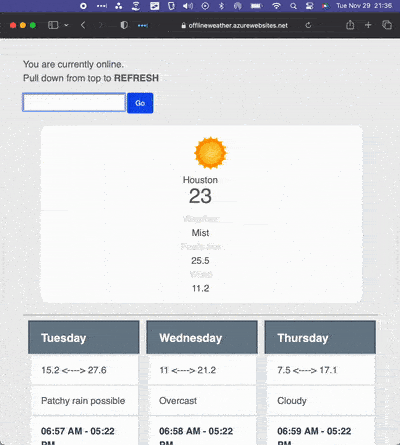

 Demo URL: https://offlineweather.azurewebsites.net/

# Offline weather

Uses [UpUp](https://www.talater.com/upup/) for offline capabilities and local storage for caching data. This is written in vanilla Javascript to minimize the use of external libraries. A minified version of Bootstrap is also used. Since this is an offline-first project, UpUp is included and required by the project.

# Why

On occasions when I go camping and  I'm high enough on a mountain I can get a very weak signal on my phone and data works temporarily. I wanted to check the weather under those bad network conditions, but without reloading the page and erasing the current forecasted conditions. On most if not all browsers, when your network connection drops, so does the page. The goal of this project was to fetch weather data as minimally as possible, and if it fails, fallback to cached data. 

See my other project [smsferret](https://github.com/snacsnoc/smsferret) for another project themed around the same premise, but with SMS.

Since the data is cached on the client side, the only outgoing request data is the API request to Weather API. 

# How

[Weather API](https://www.weatherapi.com/) is a free and very generous API to fetch weather conditions. When online, data is fetched and displayed in `index.html`. When offline, data is read from cache and displayed in `offline.html`
